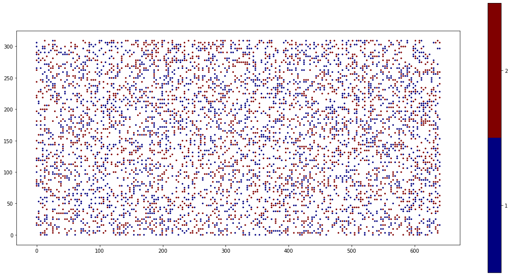
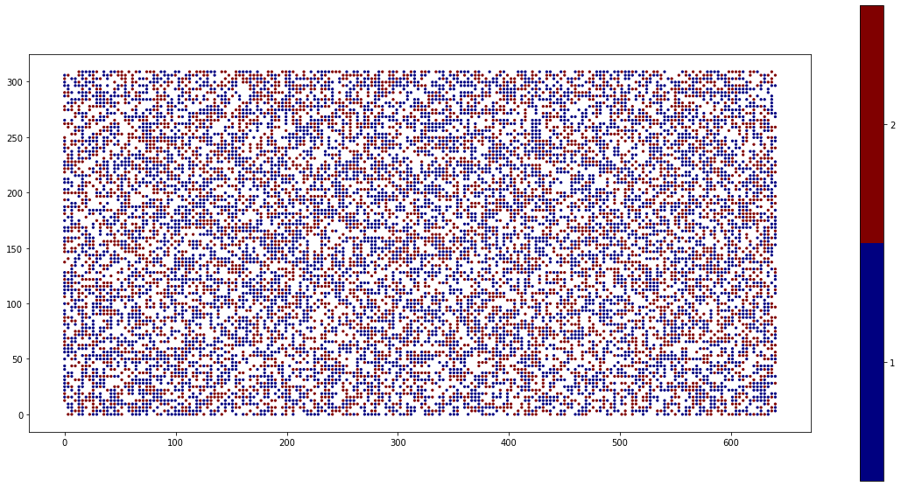

Running KinCat
==============

We can run the ``kincat.x`` executable in the ``${KINCAT_INSTALL_PATH}/bin`` directory. The following command line options are available for the current version. There are two verbose options showing input parsing and main object constructed based on the parse information. Configurations and events specification can be different as KinCat required sorted list of configurations. The ``verbose-parse`` shows raw input from the input json file. The ``verbose`` option shows the object details used in KinCat. The ``verbose-iterate`` option shows the KMC algorithm details. The verbosity has four levels: 0) show nothing, 1) basic information, 2) reserved for users verbose comments, 3) lengthy details, 4) show everything.

.. code-block:: bash

   cd ${KINCAT_INSTALL_PATH}/bin
   ./kincat.x --help
    Usage: ./kincat.x [options]
      options:
      --echo-command-line           bool      Echo the command-line but continue as normal
      --help                        bool      Print this help message
      --input                       string    Input dictionary file name
                                              (default: --input=input.json)
      --verbose                     int       Verbosity level
                                              (default: --verbose=0)
      --verbose-iterate             int       Verbosity level in KMC iteration
                                              (default: --verbose-iterate=0)
      --verbose-parse               int       Verbosity level in parsing step (not yet sorted)
                                              (default: --verbose-parse=0)
    Description:
       KinCat Main

The following command runs the RuO2 example. This example uses ``${KINCAT_INSTALL_PATH}`` environment variable. Users make sure that you export the variable in the current terminal. By default, we use Kokkos OpenMP as a default execution space for CPU processors while this example uses the serial residential time algorithm. Thus, users may want to set ``export OMP_NUM_THREADS=1`` not to carry some Kokkos overhead of using multiple threads.  

.. code-block:: bash     

   cd ${KINCAT_INSTALL_PATH}/bin		
   ./kincat.x --input="input.json" --verbose-iterate=1
   -- Kokkos::OpenMP is used
   solver_type = serial-rta
   -- Lattice : Lattice
     -- number of species : 3
     -- domain : [40, 40, 2]
     -- edge vectors : 
     [6.43,0]
     [0,3.12]
     -- basis : 
     [0,0]
     [0.5,0]
   -- ProcessDictionary : Dictionary
     -- variant ordering : (2, 4)
     -- configuration list : (45, 4)
     -- process instance list : (258, 3), constraints: (258, 2), rates : (258)
   -- ProcessDictionary : Instance details
     -- process instance list : (258), process list : (22)
   -- Solver : serial-rta
   -- Dump : Dump
     -- filename dump : "dump.json"
     -- filename site: "dump-site.json"
   -- Stats : Stats
     -- filename stats : "stats.json"
   epoch = 0, t = 1.0001e-07
     -- # of events occured : 957
    ...

This KMC runs and produces the output files ``dump.json`` and ``stats.json``. We can post-process these by using ``jupyter-lab plot-dump.ipynb``. The figures show the initial random configuration and the final configuration of the example. More details of the input file specifications will come later.  

Solving for Multiple Samples
----------------------------

For small and medium problem sizes, we recommend using a batch parallel version of kincat i.e., ``kincat-batch.x``. The specific use case of the batch parallelism will be explained later with the batch input file.

.. code-block:: bash

   cd ${KINCAT_INSTALL_PATH}/bin		
   ./kincat-batch.x --input="../example/RuO2/input-batch-RuO2.json"

For a larger problem size, we can solve multiple samples in parallel in a Sinlge Program Multiple Data (SPMD) style. The following example illustrates that the mpirun command launches two processes with two input files ``input-RuO2-0.json`` and ``input-RuO2-1.json``. These two inputs use different random seed for a demonstration purpose.

.. code-block:: bash

   cd ${KINCAT_INSTALL_PATH}/bin		
   mpirun-openmpi-clang13 -np 2 bash -c './kincat.x --input="../example/RuO2/input-RuO2-${OMPI_COMM_WORLD_RANK}.json"'

Running on Weaver (GPU)
-----------------------

To run the code with a GPU, we first allocate an interactive compute node with following command. A single node is dedicated for the user. The Power9 CPU has 40 cores and can utilize 160 threads with symmetric multi-processing (SMP4) accelerated with 4 GPUs. Since Kokkos does not support the multi GPU use case, a user explicitly maps the MPI processes to different GPUs by adding ``--kokkos-num-devices=4``. 

.. code-block:: bash

   [weaver11] bsub -Is -q rhel8 bash
   ***Forced exclusive execution
   Job <42355> is submitted to queue <rhel7W>.
   <<Waiting for dispatch ...>>
   <<Starting on weaver1>>
   [weaver1 ~]$ ./kincat.x --input='input.json' 

Restart Simulation
------------------

When a simulation completes before it reaches its steady state, the simulation can be restarted using ``dump-sites.json`` and ``dump-batch-sites.json`` output. These files contain the last snapshot of the simulation state and they are created at the end of the simulation or when the code catches an exception. See the lattice section of the input file format explained next.

   
.. autosummary::
   :toctree: generated
